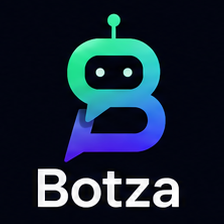
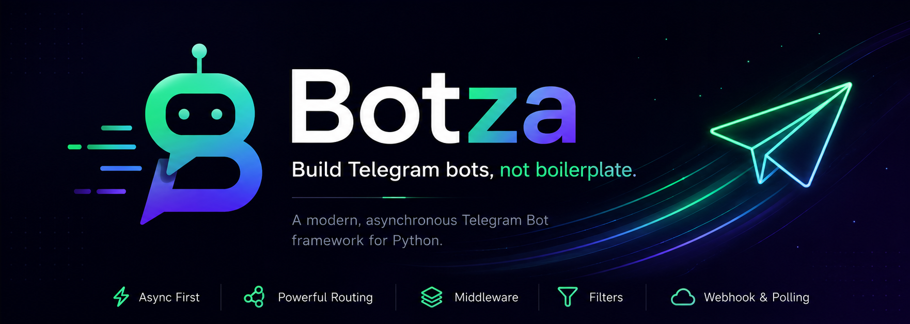

<p align="center">
  
</p>

<h1 align="center">Botza</h1>

<p align="center">
  <strong>Build Telegram bots, not boilerplate.</strong>
</p>

<p align="center">
  A modern, asynchronous Telegram Bot framework for Python.
</p>

<p align="center">
  
</p>

Instead of working directly with the Telegram Bot API, Botza provides a clean, intuitive, and developer-friendly interface inspired by modern Python frameworks.

Whether you're building a simple bot or a production-ready application, Botza helps you write less code while keeping your project organized and scalable.

---

## ✨ Features

- Clean and intuitive API
- Powerful command and message routing
- Context-based handlers
- Middleware support
- Flexible filters
- Webhook and Long Polling support
- Async-first architecture
- Fully typed
- Lightweight with minimal dependencies

---

## Philosophy

Botza is designed around one simple idea:

> Developers should spend time building bots—not dealing with HTTP requests, JSON parsing, or repetitive boilerplate.

Every API is carefully designed to feel natural, readable, and Pythonic.

---

## Example

```python
from botza import Bot

bot = Bot("TOKEN")


@bot.command("start")
async def start(ctx):
    await ctx.reply("Hello, World!")


bot.run()
```

---

## Why Botza?

Instead of this:

```python
bot.send_message(
    chat_id=update["message"]["chat"]["id"],
    text="Hello"
)
```

You simply write:

```python
await ctx.reply("Hello")
```

Simple.

Readable.

Powerful.

---

## Roadmap

- [ ] Telegram Bot API wrapper
- [ ] Router
- [ ] Filters
- [ ] Middleware
- [ ] Context
- [ ] Webhook server
- [ ] Long Polling
- [ ] Keyboard Builder
- [ ] FSM (Finite State Machine)
- [ ] Dependency Injection
- [ ] Plugin System

---

## License

MIT License
